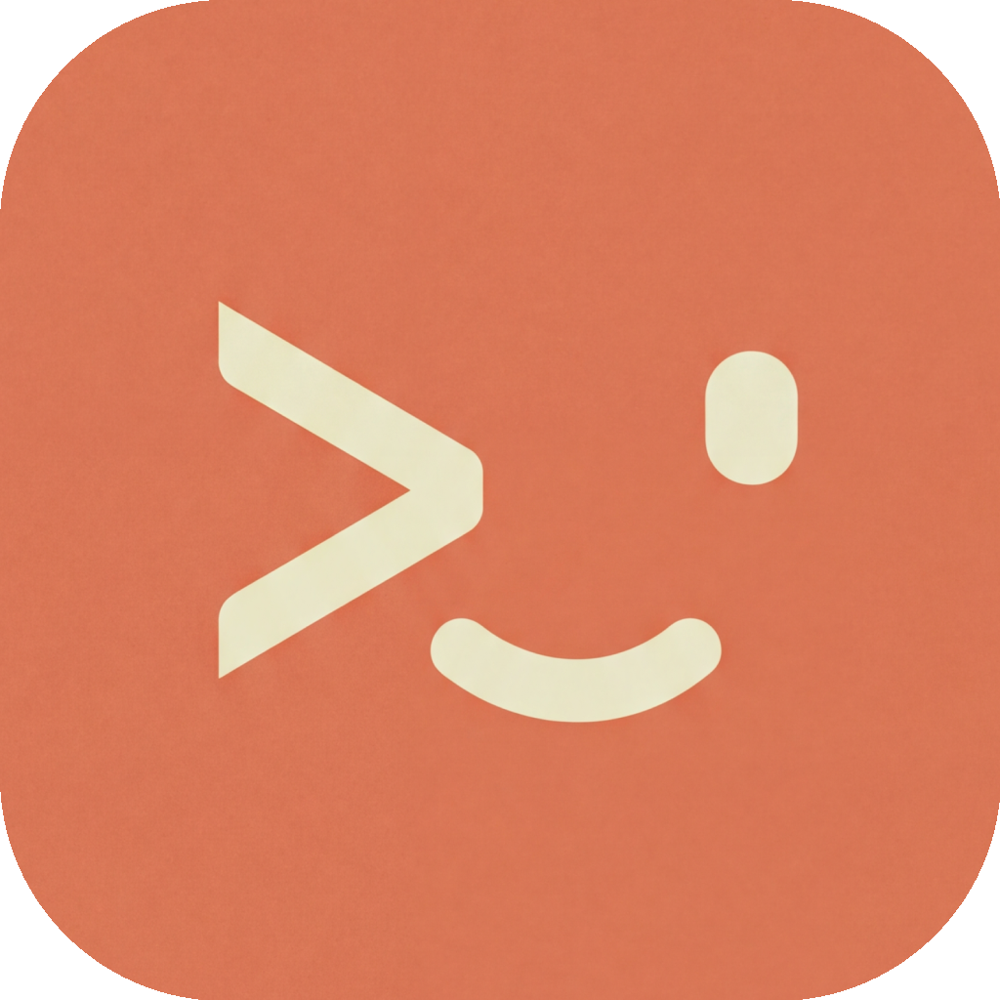

<div align="center">



# Claude Remote

### Control Claude Code from your iPhone or iPad

[](https://testflight.apple.com/join/DvR54qeU)
[](https://github.com/MJYKIM99/claude-remote/releases)
[](https://testflight.apple.com/join/DvR54qeU)

[Website](https://clauderc.com) • [Documentation](https://clauderc.com) • [Support](https://github.com/MJYKIM99/claude-remote/issues)

</div>

---

## Overview

Claude Remote brings the power of [Claude Code](https://claude.ai/code) to your iPhone or iPad. Interact with your coding sessions from anywhere — whether you're on the couch, in a meeting, or away from your desk.

Perfect for reviewing code, monitoring long-running tasks, or quick iterations without being tied to your Mac.

---

## Features

<div align="center">

### **iOS Terminal Interface**
Full terminal experience with ANSI color support and real-time output streaming

### **Quick Actions**
On-screen buttons for Enter, Esc, Tab, Arrow keys, and Ctrl+C

### **Multi-Session Management**
Create, switch, and delete multiple tmux sessions simultaneously

### **Remote File Browser**
Browse your Mac's file system and select project directories from iOS

### **Local & Remote Access**
Connect via WiFi or Cloudflare tunnel from anywhere in the world

### **Push Notifications**
Get notified when Claude completes tasks or sends hook events

### **Persistent Sessions**
Reconnect anytime — your tmux sessions keep running in the background

### **Sleep Prevention**
Keep your Mac awake while server is running

</div>

---

## How It Works

```
┌─────────────────────────────────────────────────────────────────────────────┐
│                                                                              │
│   ┌─────────────────┐              WebSocket              ┌─────────────────┐ │
│   │   iOS Device    │                                │   Mac Server    │ │
│   │                 │   ◄───────────────────────────► │                 │ │
│   │  Claude Remote  │      ws://local or wss://         │  Node.js + tmux │ │
│   │      App        │                                   │                 │ │
│   └─────────────────┘                                   └────────┬────────┘ │
│                                                                  │           │
│                                                                  ▼           │
│                                                         ┌─────────────────┐ │
│                                                         │  Claude Code    │ │
│                                                         │     CLI         │ │
│                                                         └─────────────────┘ │
│                                                                              │
└─────────────────────────────────────────────────────────────────────────────┘
```

**Three components working together:**

| Component | Platform | Role |
|-----------|----------|------|
| **iOS App** | iPhone/iPad | Remote terminal interface |
| **Mac App** | macOS 14+ | Menu bar server controller |
| **MacServer** | Node.js | Bridges iOS and Claude Code via tmux |

---

## Download

<table align="center">
<tr>
<td align="center" width="50%">
<b>iOS App</b><br><br>
<a href="https://testflight.apple.com/join/DvR54qeU">

</a>
<p><a href="https://testflight.apple.com/join/DvR54qeU">Join TestFlight Beta</a></p>
</td>
<td align="center" width="50%">
<b>Mac Server</b><br><br>
<a href="https://github.com/MJYKIM99/claude-remote/releases/download/v1.1/ClaudeRemote-Mac-1.1.dmg">

</a>
<p><a href="https://github.com/MJYKIM99/claude-remote/releases">Releases</a></p>
</td>
</tr>
</table>

---

## Requirements

| Platform | Minimum Version | Notes |
|----------|----------------|-------|
| **macOS** | 14.0 Sonoma | Required for Mac app |
| **iOS** | 17.0 | iPhone or iPad |
| **Node.js** | 16.0+ | Auto-installed by Mac app |
| **tmux** | Latest | Auto-installed by Mac app |
| **Claude Code CLI** | Latest | Install from claude.ai/code |

> The Mac app will automatically guide you through installing any missing dependencies.

---

## Quick Start

### Step 1: Install the Mac App

Download the DMG from [Releases](https://github.com/MJYKIM99/claude-remote/releases), open it, and drag **Claude Remote** to your Applications folder.

### Step 2: Launch

Open Claude Remote from Applications. You'll see a menu bar icon.

### Step 3: Setup Dependencies

If prompted, allow the app to install dependencies (Homebrew, Node.js, tmux).

### Step 4: Start Server

Click **"Start Server"** in the menu. The server will:
- Start on port `8765`
- Display your Mac's local IP address
- Optionally create a Cloudflare tunnel for public access

### Step 5: Connect from iOS

1. Open Claude Remote on your iOS device
2. Enter your Mac's IP address (shown in the Mac app)
3. Tap **"Connect"**

### Step 6: Start Coding

1. Tap **"Sessions"** → **"Browse & Select Project"**
2. Navigate to your project folder
3. Tap **"Create & Start Claude"**
4. Start coding from your iPhone!

---

## Connection Modes

### Local Network (WiFi)

Default mode for home/office use.

```
ws://192.168.1.x:8765
```

Ensure your iOS device and Mac are on the same WiFi network.

### Public Access (Cloudflare Tunnel)

Connect from anywhere using a secure tunnel.

```bash
# Install Cloudflare CLI
brew install cloudflared
```

Then in the Mac app:
1. Enable **"Public Access"**
2. The app generates a `wss://` URL
3. Use this URL in the iOS app

---

## Session Management

| Action | How |
|--------|-----|
| **Create** | Sessions → Browse & Select Project → Choose folder → Create & Start Claude |
| **Switch** | Tap any session name in the sessions list |
| **Delete** | Swipe left on a session or tap the trash icon |

Sessions persist even if you close the iOS app. Reconnect anytime to resume.

---

## Quick Actions Reference

| Button | Action | Use Case |
|--------|--------|----------|
| `Enter` | Send newline | Submit commands |
| `Esc` | Escape key | Exit modes, cancel |
| `Tab` | Tab completion | Auto-complete paths/commands |
| `↑↓←→` | Arrow keys | Navigate history, edit input |
| `Ctrl+C` | Interrupt | Stop running commands |

---

## Push Notifications

Receive notifications when Claude completes tasks.

### Setup

1. Enable notifications in iOS Settings for Claude Remote
2. Configure Claude Code hooks to send events to the server:

```bash
# Example: Add to your Claude Code hooks
curl -X POST http://localhost:8765/hook \
  -H "Content-Type: application/json" \
  -d '{"event":"Stop","project":"MyProject"}'
```

### Supported Events

| Event | Description |
|-------|-------------|
| `Start` | Session started |
| `Stop` | Session stopped |
| `Notification` | Custom notification |

---

## Security

### API Key Authentication (Optional)

Add authentication to protect your server:

```bash
export CLAUDE_REMOTE_API_KEY="your-secure-key"
```

Then enter the same key in iOS app settings.

### Path Restrictions

File operations are restricted to your home directory by default. Customize:

```bash
export CLAUDE_REMOTE_ALLOWED_PATH="/Users/yourname/Projects"
```

### Cloudflare Tunnel

Public access uses Cloudflare's secure tunnel with TLS encryption — no open ports on your Mac.

---

## Troubleshooting

### Cannot connect to server

- Verify Mac and iOS are on the same network
- Check Mac firewall allows connections on port 8765
- Confirm server is running: `lsof -i :8765`

### Connection drops frequently

- Check WiFi stability
- Server heartbeat: 45 seconds with 2-miss tolerance
- iOS app auto-reconnects up to 5 times

### Claude not starting

- Ensure Claude Code CLI is installed: `claude --version`
- Check tmux is installed: `tmux -V`
- Verify the working directory exists
- Check server logs in the Mac app

---

## Documentation

Visit [clauderc.com](https://clauderc.com) for:
- Visual setup guides
- Advanced configuration
- Troubleshooting tips
- Release notes

---

## License

This software is proprietary. See [LICENSE](LICENSE) for details.

---

## Support

- [Report Issues](https://github.com/MJYKIM99/claude-remote/issues)
- [Discussions](https://github.com/MJYKIM99/claude-remote/discussions)
- [Website](https://clauderc.com)

---

<div align="center">

Copyright 2026 [TacticSpace Tech](https://tacticspacetech.com/). All rights reserved.

</div>
