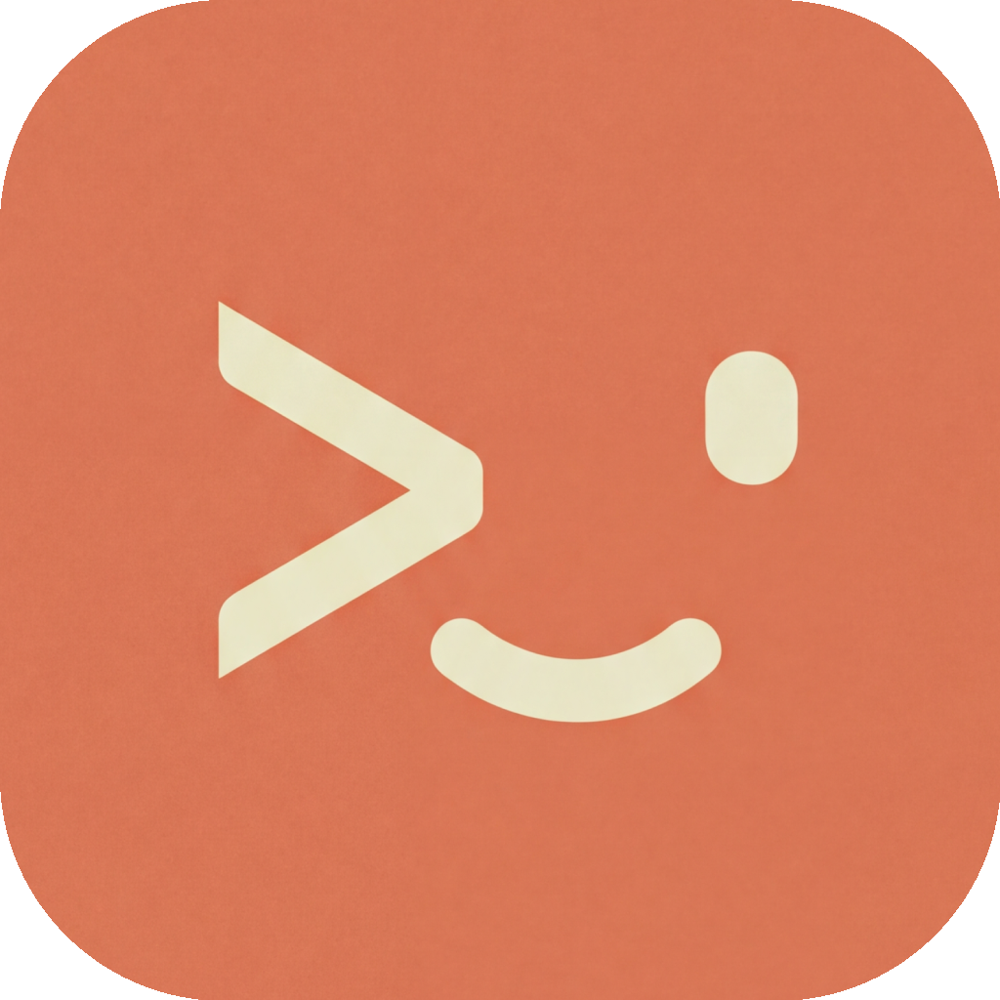

<div align="center">



# Tactic Remote

### Control Claude Code, Codex, Amp, and Droid from your iPhone or iPad

[](https://apps.apple.com/us/app/tactic-remote-ai-coding/id6758008464)
[](https://github.com/TacticSpaceTech/TacticRemote/releases)
[](https://www.npmjs.com/package/tacticremote)
[](https://apps.apple.com/us/app/tactic-remote-ai-coding/id6758008464)

[Website](https://tacticremote.com) • [Documentation](https://tacticremote.com/docs) • [Support](https://github.com/TacticSpaceTech/TacticRemote/issues)

</div>

---

> **Tactic Remote 1.10** brings updated Mac and Windows companions, smoother account and Tactic Relay connections, and a project-based home screen on iPhone and iPad. Your coding agents keep running on your computer while you check progress and continue the work from your mobile device.

---

## Overview

Tactic Remote brings AI coding agents to your iPhone or iPad. Run Claude Code, OpenAI Codex, Sourcegraph Amp, or Factory Droid on your computer, then monitor output, send prompts, approve blocking steps, review code changes, and keep long-running work moving from your mobile device.

It is built for developers who want to stay close to AI coding sessions without staying at their desk.

---

## What's New in 1.10

- **Windows account connections** — Sign in, bind your PC, and connect from an iPhone or iPad using the same Tactic account.
- **Tactic Relay** — Connect to your Mac or Windows PC remotely, with end-to-end encrypted terminal and file transfers.
- **Mac 1.10 companion** — A signed and Apple-notarized installer for Apple Silicon and Intel Macs, with the Node.js runtime included.
- **Project-based home screen** — Find a project, then return to its Agent conversations on iPhone and iPad.
- **Review before sending** — Commands and reusable prompts go into a draft, ready for your context.

This release includes the Mac 1.10.0 companion and Windows 1.10.0 Preview alongside the iPhone and iPad app. The Mac/Linux CLI remains a separate published package; use its own release information for version details.


---

## Features

<div align="center">

### **Chat Mode for Agent Output**
Read agent messages, tool calls, Thinking sections, and streaming updates in a mobile-friendly layout

### **Quick Prompts Library**
Save common review, test, debug, and summary prompts so repeat workflows are always close

### **Mobile Git Review**
View changed files, inspect diffs, and decide whether an agent's work should continue

### **Multi-Agent Sessions**
Choose Claude Code, OpenAI Codex, Sourcegraph Amp, or Factory Droid when creating a session

### **Git Worktree Workflow**
Group sibling worktrees and switch between parallel implementation branches

### **Smart Prompt Toolbar**
Auto-reveals shortcuts for blocking TUI prompts like confirmations and trust dialogs

### **Terminal Mode**
Full terminal with ANSI color support, real-time streaming, search, and keyboard submit

### **iPad-Optimized Layout**
Native split-view with hardware keyboard shortcuts

### **Cloud Speech-to-Text**
Dictate prompts in 25+ languages

### **File Uploads**
Send files from iOS to the remote server

### **Multi-Session Management**
Create, switch, and manage multiple Agent sessions

### **Remote File Browser**
Browse your computer's file system and select project directories from iOS

### **Local & Remote Access**
Connect on your local network, or use Tactic Relay with the Mac or Windows 1.10 companion for remote access. Advanced tunnel connections remain available.

### **Push Notifications**
Get notified when an agent completes tasks or sends hook events

### **Live Activity & Widgets**
Real-time agent status on Lock Screen, Dynamic Island, and Home Screen widgets

### **App Lock**
Protect sessions with Face ID or Touch ID

</div>

---

## How It Works

```text
┌──────────────────────────────────────────────────────────────────────────┐
│                                                                          │
│   ┌─────────────────┐            WebSocket            ┌─────────────────┐│
│   │   iOS Device    │                                 │ Mac/Linux/Win   ││
│   │                 │  ◄─────────────────────────►    │                 ││
│   │  Tactic Remote  │    ws://local or wss://         │  Server (Node)  ││
│   │      App        │                                 │                 ││
│   └─────────────────┘                                 └────────┬────────┘│
│                                                                │         │
│                                                                ▼         │
│                                                       ┌─────────────────┐│
│                                                       │ Coding Agent    ││
│                                                       │Claude/Codex/Amp/││
│                                                       │      Droid      ││
│                                                       └─────────────────┘│
│                                                                          │
└──────────────────────────────────────────────────────────────────────────┘
```

**Four ways to run the server:**

| Method | Platform | Command |
|--------|----------|---------|
| **npx** | Mac / Linux | `npx tacticremote` |
| **Homebrew** | Mac | `brew install TacticSpaceTech/tap/tacticremote` |
| **Mac App** | macOS 14.6+ | Menu bar GUI with one-click start and auto-update |
| **Windows App** (Preview) | Windows 10/11 x64 | Companion app — preview release, may have issues |

---

## Quick Start

The fastest way to get started on Mac or Linux is one command:

```bash
npx tacticremote
```

Scan the QR code with the Tactic Remote iOS app and you are connected.

### Options

```text
npx tacticremote [options]

  -p, --port <n>      Port to listen on          (default: 8765)
  --path <dir>        Allowed base directory      (default: $HOME)
  --api-key <key>     Require authentication key
  --tunnel            Enable Cloudflare Tunnel for remote access
  --no-qr             Do not show QR code
  -h, --help          Show this help
```

### Alternative: Mac Menu Bar App

If you prefer a graphical interface:

1. **Download** the DMG from [Releases](https://github.com/TacticSpaceTech/TacticRemote/releases/tag/v1.10.0)
2. **Install** by opening the DMG and dragging **Tactic Remote** to Applications
3. **Launch** from Applications; a menu bar icon will appear
4. **Start Server** from the menu bar app
5. **Connect** from Tactic Remote on your iPhone or iPad

The Mac app also provides:

- Tactic account host binding and encrypted Tactic Relay connections
- A bundled Node.js runtime for Apple Silicon and Intel Macs
- One-click Cloudflare Tunnel for remote access
- Live client count and session monitoring
- Copy server URL, tunnel address, and API key from the menu
- Server compatibility status
- Prevent Sleep while the server is running
- Language switcher for 8 languages
- Auto-start on login
- In-app update checks

### Alternative: Windows Companion App (Preview)

> 🟡 **Preview release.** The Windows companion is published as a preview. Most flows work, but expect rough edges compared to the Mac app and iOS app. We recommend macOS users continue using the Mac companion; we welcome bug reports from Windows users.

1. **Download** the installer from [Releases](https://github.com/TacticSpaceTech/TacticRemote/releases/tag/v1.10.0): `TacticRemote-Windows-Setup-1.10.0.exe`
2. **Install** by running the installer (Windows 10 or 11, x64)
3. **Launch** Tactic Remote from the Start menu
4. **Start Server** from the app window
5. **Connect** from Tactic Remote on your iPhone or iPad

Known limitations of the preview:

- The installer is not yet code-signed, so Windows SmartScreen may show a warning. Verify that it came from the official Tactic Remote release page before continuing.
- Some terminal scenarios (long ConPTY sessions, complex pairings) may need restart
- Auto-update is not yet enabled — new versions install manually
- Please report issues at [the issue tracker](https://github.com/TacticSpaceTech/TacticRemote/issues)

---

## Download

<table align="center">
<tr>
<td align="center" width="25%">
<b>iOS App</b><br>
<i>iPhone / iPad</i><br><br>
<a href="https://apps.apple.com/us/app/tactic-remote-ai-coding/id6758008464">

</a>
</td>
<td align="center" width="25%">
<b>Mac App</b><br>
<i>macOS 14.6+</i><br><br>
<a href="https://github.com/TacticSpaceTech/TacticRemote/releases/tag/v1.10.0">

</a>
</td>
<td align="center" width="25%">
<b>Windows App</b> 🟡<br>
<i>Windows 10/11 — Preview</i><br><br>
<a href="https://github.com/TacticSpaceTech/TacticRemote/releases/tag/v1.10.0">

</a>
</td>
<td align="center" width="25%">
<b>CLI</b><br>
<i>Mac / Linux</i><br><br>
<code>npx tacticremote</code>
</td>
</tr>
</table>

---

## Requirements

| Platform | Minimum Version | Notes |
|----------|----------------|-------|
| **iOS** | 16.4 | iPhone or iPad |
| **macOS** | 14.6 Sonoma | Mac app; supports Apple Silicon and Intel |
| **Windows** | 10 or 11 (x64) | For Windows companion app (Preview) |
| **Linux** | Any | For CLI (`npx tacticremote`) |
| **Node.js** | See the CLI package requirements | Included in the Mac companion; no separate Node.js installation needed for the DMG |
| **tmux** | Latest | Required by Mac/Linux backends; auto-installed by the Mac app or Homebrew |
| **AI coding agent CLI** | Latest | Install and sign in to at least one: Claude Code, OpenAI Codex, Sourcegraph Amp, or Factory Droid |

---

## Connection Modes

### Local Network

Default mode for home or office use.

```text
ws://192.168.1.x:8765
```

Ensure your iOS device and computer are on the same Wi-Fi network.

### Tactic Relay

Use the Mac or Windows 1.10 companion to bind your computer to your Tactic account and enable Relay. On iPhone or iPad, sign in to the same account, select the computer, and follow the connection prompts. Keep the host computer running and online.

Relay transfers end-to-end encrypted terminal and file data. Your Agent tools continue to use the credentials configured on the host computer; signing in to Tactic does not copy Agent credentials between computers.

### Public Access with Cloudflare Tunnel

Connect from anywhere using a secure tunnel, without opening ports on your machine:

```bash
npx tacticremote --tunnel
```

The server generates a `wss://` URL automatically. Use this URL in the iOS app.

---

## Security

### API Key Authentication

```bash
npx tacticremote --api-key "your-secure-key"
```

Then enter the same key in the iOS app.

### Path Restrictions

File operations are restricted to your home directory by default. Customize the allowed base path:

```bash
npx tacticremote --path "/Users/yourname/Projects"
```

### Tactic Relay

Tactic Relay forwards end-to-end encrypted terminal and file data. Account binding manages access to the host; it does not move your projects or Agent credentials to another computer.

### Cloudflare Tunnel

Tunnel access uses Cloudflare's secure tunnel with TLS encryption, so you do not need to open inbound ports.

---

## Troubleshooting

### Cannot connect to server

- For local connections, verify your computer and iOS device are on the same network and the firewall allows the server port (8765 by default).
- For Tactic Relay, verify the host is bound to the expected account, Relay is online, and the host computer is awake.
- Confirm the server is running: `lsof -i :8765` on Mac/Linux or `Get-NetTCPConnection -LocalPort 8765` in Windows PowerShell

### Connection drops frequently

- Check the network connection on both devices and keep the host computer awake.
- For Relay, check the companion's Relay status and select the computer again after connectivity returns.

### Agent not starting

- Ensure your selected agent CLI is installed and signed in: `claude --version`, `codex --version`, `amp --version`, or `droid --version`
- On Mac/Linux, check tmux is available: `tmux -V`. Windows uses its own terminal backend and does not require tmux.
- Verify the working directory exists

---

## Documentation

Visit [tacticremote.com](https://tacticremote.com) for:
- Visual setup guides
- Advanced configuration
- Troubleshooting tips
- Release notes

---

## License

This software is proprietary. See [LICENSE](LICENSE) for details.

---

## Support

- [Report Issues](https://github.com/TacticSpaceTech/TacticRemote/issues)
- [Discussions](https://github.com/TacticSpaceTech/TacticRemote/discussions)
- [Website](https://tacticremote.com)

---

<div align="center">

Copyright 2025-2026 [TacticSpace Tech](https://tacticspacetech.com/). All rights reserved.

</div>
